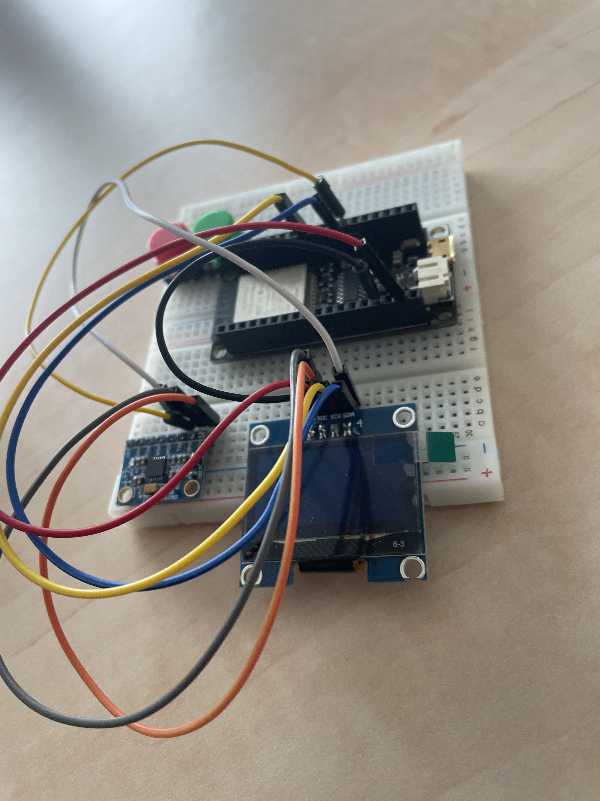

# Gesture-Controlled Drone/Model Vehicle Using ESP32, Motion Sensors, and Machine Learning

## Overview
This project focuses on the development of a gesture-controlled drone or model vehicle using an ESP32 microcontroller, motion sensors (such as an accelerometer and gyroscope), and machine learning-based gesture recognition. The aim is to provide an intuitive control mechanism through hand gestures, enabling seamless drone navigation without traditional remote controllers.

## Features
- **ESP32-based System**: Utilizes the ESP32 microcontroller for real-time processing and control.
- **Motion Sensor Integration**: Incorporates an accelerometer and gyroscope to capture hand movements.
- **Machine Learning-based Gesture Recognition**: Uses Edge Impulse for training a gesture classifier and deploys it on the ESP32.
- **Wireless Communication**: Establishes Wi-Fi or Bluetooth connectivity for interaction with the drone.
- **OLED Display**: Provides real-time status updates on the controller.

## Hardware Components
- **ESP32 microcontroller**
- **Accelerometer (e.g., MPU6050)**
- **Push buttons**
- **OLED display**
- **Wi-Fi/Bluetooth module**
- **Drone or model vehicle**

## Software Tools
- **Programming Languages**: C/C++ (Arduino IDE) or MicroPython
- **Machine Learning Platform**: [Edge Impulse](https://edgeimpulse.com/)
- **Embedded Development Frameworks**: ESP-IDF, Arduino ESP32

## Project Workflow
### 1. Data Collection
- Motion data is gathered from the accelerometer using an ESP32.
- Multiple hand gestures (e.g., move forward, rotate, stop) are recorded.
- Data is stored and formatted for processing in Edge Impulse.

### 2. Model Training with Edge Impulse
- The collected data is uploaded to Edge Impulse.
- Feature extraction techniques (e.g., spectral analysis) are applied.
- A machine learning classifier is trained to recognize gestures.
- The trained model is exported in TensorFlow Lite format.

### 3. Deployment on ESP32
- The model is converted and integrated into the ESP32 firmware.
- Real-time classification is performed on incoming sensor data.
- Commands are transmitted to the drone based on recognized gestures.

### 4. Integration with the Drone
- The ESP32 communicates with the drone's control system.
- Gesture-based commands are mapped to flight actions.
- A control interface ensures smooth interaction between the microcontroller and the drone.

### 5. Testing and Optimization
- The system is tested in real-world scenarios.
- Accuracy and latency of gesture recognition are analyzed.
- Hyperparameters and model structure are optimized for performance improvements.

## Results
During testing, different models were evaluated:
- **Edge Impulse Model**:
  - Training accuracy: **88.7%**
  - Validation accuracy: **87.5%**
  - Testing accuracy: **83.65%**
  - High accuracy observed for gestures like "DOWN" (**95.3%**) and "STOP" (**99.5%**), while "FORWARD" and "LEFT" had lower recognition rates.
- **Locally Developed Model**:
  - Training accuracy: **92.1%**
  - Validation accuracy: **89.29%**
  - Testing accuracy: **69%**
  - Overfitting detected, requiring better generalization strategies.
  
The results indicate that the Edge Impulse model had better generalization, while the locally trained model provided more flexibility but needed improvements in real-world adaptability.

## References
- **ESP32-based Drone Controller**: [Hackster.io Project](https://www.hackster.io/jjs357/esp32-based-drone-controller-db079d)
- **Machine Learning on Embedded Systems**: [Edge Impulse](https://edgeimpulse.com/)
- **ESP32 Programming Resources**:
  - [ESP Arduino](https://github.com/tomas-fryza/esp-arduino)
  - [ESP-IDF](https://github.com/tomas-fryza/esp-idf)
  - [ESP MicroPython](https://github.com/tomas-fryza/esp-micropython)
- **Related Research and Articles**:
  - Starner, T. (2000). Gesture-based interfaces and applications.
  - Pfeil, M., & Koh, S. (2011). User-friendly drone control using gestures.
  - Lee, J. et al. (2014). Smartphone accelerometers for real-time gesture recognition.
  - Krupka, P. & Verner, P. (2013). Machine learning classification of human gestures.
  - Gupta, R. & Quy, P. (2019). Edge computing and real-time gesture recognition.
  - Kratz, S., & Rohs, M. (2009). A $3 gesture recognizer for embedded systems.
  - Lopez, G., & Pfeiffer, S. (2021). Edge computing for real-time gesture recognition.
  - Yuan, Q., & Thalmann, D. (2020). Gesture-based human-drone interaction: A review.

## Future Work
- **Expand Dataset**: Increase the number of gesture samples for improved recognition accuracy.
- **Optimize Model Deployment**: Use advanced feature selection and hyperparameter tuning.
- **Improve Real-Time Performance**: Enhance responsiveness of classification on the ESP32.
- **Drone Integration Enhancements**: Refine the mapping of gestures to precise drone movements.
- **User-Friendly Interface**: Develop an intuitive GUI for customization and monitoring.
- **ESP32-Drone Connection**: Continue working on the integration between the ESP32 and the drone to establish a stable and efficient communication link.
- **Improve Model Generalization**: Further optimize the local model to prevent overfitting and ensure better real-world accuracy.
